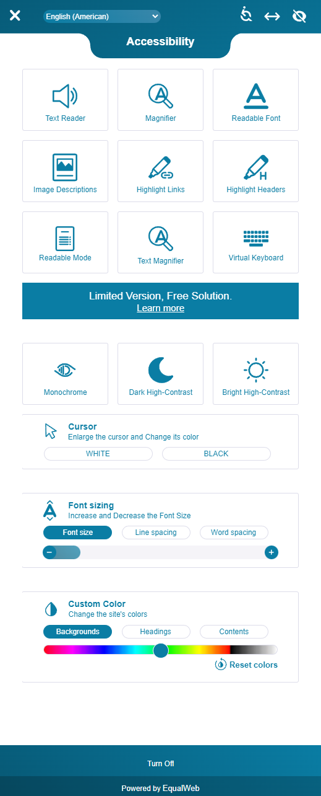

# equalweb-accessibility
## [EqualWeb](https://www.equalweb.com/)
### Quick website built in React to test integrating EqualWeb accessiblity functions into other websites.

#### How to use:
- Create account on [EqualWeb](https://www.equalweb.com/)
- Add a new site to your account [here](https://login.equalweb.com/?page=siteProcess)
- Paste the provided script tag in your index.html, OR copy your sitekey into the AccessibilityScript function in this code

